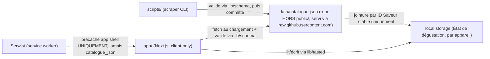

# Architecture Spine — Crounch

## Design Paradigm

App 100% côté client : aucune donnée ne transite par un serveur applicatif. Deux stores indépendants, reliés par un schéma partagé et versionné, alimentent l'UI :
- **Catalogue** (distant, rejouable) — récupéré via fetch depuis GitHub, mis en cache localement.
- **État de dégustation** (local, autoritatif) — écrit/lu en local storage, jamais transmis.

Organisation en dossiers Next.js App Router, par feature :
- `app/` — routes/pages (App Router, export statique).
- `components/` — UI, shadcn/ui + couche de marque Crounch.
- `lib/schema/` — types + validation runtime partagés (Catalogue, Saveur, État de dégustation) — consommés par l'app ET le scraper.
- `lib/catalogue/` — fetch, cache, stale-while-revalidate du Catalogue.
- `lib/tasted/` — lecture/écriture de l'État de dégustation en local storage.
- `scripts/` (ou `tools/`) — outil de scraping (mainteneur uniquement, hors bundle app).

## Invariants & Rules

### AD-1 — Frontière de données Catalogue ⇄ État de dégustation [ADOPTED]

- **Binds:** FR-1, FR-2, FR-3, FR-4, FR-5
- **Prevents:** Un rafraîchissement du Catalogue qui écraserait ou désynchroniserait silencieusement l'État de dégustation ; une Saveur qui change d'identifiant après un renommage ; une Saveur qui disparaît du Catalogue au lieu d'être archivée.
- **Rule:** Le Catalogue (cache) et l'État de dégustation (local storage) sont deux stores indépendants, joints **uniquement par l'identifiant stable de Saveur** — jamais par position/index. Cet identifiant est **minté une seule fois par le scraper** dans un registre d'identité maintenu (pas re-dérivé du nom d'affichage à chaque exécution — un renommage ne change pas l'ID). Une fois publiée, une Saveur n'est **jamais retirée** de `catalogue.json` : elle transitionne `active` → `archived`, elle ne disparaît pas. L'État de dégustation n'est jamais recalculé ni purgé par un rafraîchissement du Catalogue.

### AD-2 — Chargement du Catalogue : stale-while-revalidate, fraîcheur à source unique

- **Binds:** FR-1
- **Prevents:** Un écran de chargement systématique alors qu'un cache existe déjà ; une réponse réseau plus ancienne qui écrase une réponse plus récente (race de revalidation) ; un service worker qui re-sert une version périmée du Catalogue en la faisant passer pour le rafraîchissement réseau.
- **Rule:** Si un Catalogue est en cache local, l'afficher immédiatement, puis déclencher un fetch réseau en arrière-plan et remplacer les données dès réponse. Si aucun cache n'existe, attendre la réponse réseau avant d'afficher le contenu. Le payload du Catalogue porte un marqueur de révision monotone (`generatedAt`, écrit par le scraper) ; `lib/catalogue/` rejette toute réponse dont la révision est antérieure à celle actuellement détenue. **`lib/catalogue/` est le seul propriétaire de la fraîcheur du Catalogue** : l'URL distante du Catalogue est explicitement exclue du precache/runtime-cache de Serwist (le service worker ne cache que l'app shell, jamais les données).

### AD-3 — Dégradation au premier lancement et sur réponse invalide

- **Binds:** FR-1
- **Prevents:** Un catalogue vide affiché silencieusement ; une réponse HTTP 200 mais invalide (JSON malformé ou hors schéma) traitée comme un succès qui corromprait le cache.
- **Rule:** Un fetch est considéré en échec — traité de façon identique — dans les trois cas : réponse réseau qui échoue, réponse non-2xx, ou JSON qui ne valide pas contre le schéma partagé (`lib/schema/`). Si un tel échec survient et qu'aucun cache local n'existe, afficher un état d'erreur explicite ("Impossible de charger le catalogue, vérifie ta connexion") avec une action de réessai — jamais un état vide silencieux. Un échec de rafraîchissement en arrière-plan (cache existant) laisse le cache existant intact.

### AD-4 — Aucun code serveur applicatif, frontière Client Component explicite [ADOPTED]

- **Binds:** all
- **Prevents:** L'introduction progressive de routes API / logique serveur ; un module qui accède à `localStorage`/`window` depuis un Server Component et casse le prerender statique.
- **Rule:** Next.js est buildé en export statique (`output: 'export'`). Aucune route API, Server Action ou logique dépendant d'un runtime serveur n'est ajoutée. Tout module de `lib/catalogue/` et `lib/tasted/` qui touche `localStorage`, `window` ou tout autre global navigateur est un **Client Component explicite** (`'use client'`), jamais évalué pendant le prerender statique.

### AD-5 — Source de vérité et identification des Saveurs pour le scraping

- **Binds:** FR-5
- **Prevents:** Une incohérence silencieuse selon quel scraper/exécution a tourné en dernier ; deux exécutions qui identifient différemment "la même Saveur" entre brets.fr et Open Food Facts (fusion vs doublon).
- **Rule:** En cas de divergence de données entre brets.fr et Open Food Facts pour une même Saveur, brets.fr fait autorité (nom, visuel, statut) ; Open Food Facts sert de complément/fallback quand une donnée est absente de brets.fr. Le rapprochement entre les deux sources se fait via une **clé de matching canonique documentée** (ex: nom normalisé + variante), avec une **table de correspondance maintenue** pour les cas ambigus — jamais une fusion automatique silencieuse.

### AD-6 — Un seul repo, un seul écosystème

- **Binds:** FR-5, all
- **Prevents:** Une divergence d'outillage/toolchain entre l'app et le scraper qui complique la maintenance solo.
- **Rule:** L'app Next.js et l'outil de scraping vivent dans le même repo. Le scraper est en Node.js/TypeScript (même langage que l'app), exécuté manuellement en CLI, sans automatisation planifiée.

### AD-7 — Schéma partagé et versionné (Catalogue, Saveur, État de dégustation)

- **Binds:** FR-1, FR-3, FR-4, FR-5
- **Prevents:** Le scraper et l'app qui divergent silencieusement sur la forme des données (enveloppe JSON, `image` en string vs objet, État de dégustation en tableau vs map) alors que chacun respecte AD-1 à la lettre.
- **Rule:** Un unique module `lib/schema/` définit les types TypeScript et la validation runtime du Catalogue, d'une Saveur, et de l'État de dégustation. Le scraper **valide sa sortie contre ce schéma avant de committer** `catalogue.json` ; l'app valide toute réponse réseau contre ce même schéma avant de remplacer son cache (cf. AD-3). Aucun des deux ne peut définir sa propre forme de données indépendamment.

### AD-8 — Mutation atomique de l'État de dégustation

- **Binds:** FR-3, FR-4
- **Prevents:** Deux actions de bascule concurrentes (deux clics rapprochés, ou deux onglets) qui s'écrasent l'une l'autre via un read-modify-write périmé.
- **Rule:** Toute mutation de l'État de dégustation passe par une **unique fonction canonique** dans `lib/tasted/` (ex: `setTasted(id, boolean)`), qui relit l'état persistant le plus récent immédiatement avant écriture — jamais depuis un instantané en mémoire potentiellement périmé. La synchronisation multi-onglets suit un simple "dernière écriture gagne" : c'est un risque accepté explicitement (usage mono-utilisateur, faibles enjeux), pas un cas ignoré silencieusement.

**Direction de dépendance :**



## Consistency Conventions

| Concern | Convention |
| --- | --- |
| Naming (entités, fichiers) | Saveur = `flavor` en code (id, name, image, status). Statuts : `active` \| `archived`. |
| Data & formats (ids) | Identifiant de Saveur : slug stable (kebab-case), minté une seule fois par le scraper dans un registre d'identité, jamais réattribué ni re-dérivé du nom après un renommage. |
| Data & formats (schéma) | Catalogue, Saveur et État de dégustation sont définis et validés par le module partagé `lib/schema/` (AD-7) — aucune forme de données locale à un module. |
| État & cross-cutting | Toute écriture en local storage passe par `lib/tasted/` via sa fonction canonique de mutation (AD-8). Toute lecture/cache du Catalogue passe par `lib/catalogue/`, seul propriétaire de la fraîcheur (AD-2). |

## Stack

| Name | Version |
| --- | --- |
| Next.js (App Router, export statique) | 16.x |
| React | 19.x (aligné Next.js 16, min. 19.2) |
| shadcn/ui | dernière (compatible export statique, aucune config spéciale pour les composants first-party) |
| Serwist (`@serwist/next`) | dernière (PWA/service worker, successeur maintenu de next-pwa) |
| Node.js/TypeScript | pour l'app ET le scraper (même toolchain) |
| Hébergement | Netlify (déploiement statique) |
| Stockage | local storage navigateur uniquement (aucune base de données, aucun backend) |

## Structural Seed

```text
/
  app/                     # Next.js App Router, export statique
    layout.tsx
    page.tsx               # grille du Catalogue
  components/              # UI (shadcn/ui + couche de marque Crounch)
  lib/
    schema/                 # types + validation runtime partagés (Catalogue, Saveur, État de dégustation)
    catalogue/              # fetch + cache + stale-while-revalidate, seul propriétaire de la fraîcheur
    tasted/                 # mutation canonique + lecture de l'État de dégustation (local storage)
  public/
    manifest.json            # PWA (PAS catalogue.json — voir data/ ci-dessous)
  data/
    catalogue.json           # committé/régénéré par le scraper, HORS de l'arbre de build Next.js,
                              # servi via raw.githubusercontent.com pour permettre une mise à jour
                              # SANS rebuild/redéploiement de l'app (FR-1, UJ-3)
  scripts/ (ou tools/)      # outil de scraping (Node/TS, CLI, mainteneur uniquement)
  sw.ts                     # service worker (Serwist) — precache l'app shell uniquement
```

## Capability → Architecture Map

| Capability / Area | Lives in | Governed by |
| --- | --- | --- |
| FR-1 Chargement du Catalogue | `lib/catalogue/`, `data/catalogue.json` | AD-2, AD-3, AD-4, AD-7 |
| FR-2 Affichage grille | `app/page.tsx`, `components/` | Design Paradigm |
| FR-3 Marquer goûté/pas goûté | `lib/tasted/` | AD-1, AD-8 |
| FR-4 Persistance État de dégustation | `lib/tasted/` | AD-1, AD-8 |
| FR-5 Scraping du Catalogue | `scripts/` | AD-5, AD-6, AD-7 |

## Deferred

- Notation/commentaire par saveur (v2, hors MVP) — pas d'impact structurel tant qu'ils ne sont pas spécifiés.
- Synchronisation multi-appareils — explicitement hors scope produit ; si elle apparaît un jour, elle casse AD-4 (nécessiterait un backend) et devra être une nouvelle spine, pas une extension de celle-ci.
- Automatisation planifiée du scraping (cron) — hors scope MVP, laissé à une itération future si le besoin apparaît.
- Synchronisation multi-onglets au-delà du "dernière écriture gagne" (AD-8) — acceptée comme risque faible (usage mono-utilisateur) ; à revisiter seulement si un usage multi-onglets simultané pose problème en pratique.
- Rate limit de `raw.githubusercontent.com` (~60 req/h/IP non-authentifié depuis mai 2025) — accepté comme risque faible à cette échelle (usage perso/entre amis, un fetch par ouverture, cache local en secours) ; à revisiter si l'app grandit ou si des 429 sont observés en usage réel.
- Piège connu de génération de `sw.js` avec Serwist + `output: 'export'` (issue vercel/next.js#73457) — point d'attention à l'implémentation (tester le pipeline de build tôt), pas un blocage architectural.
- Migration de version du schéma partagé (AD-7) en cas de changement cassant — laissé au code une fois le schéma initial écrit.
